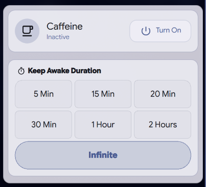
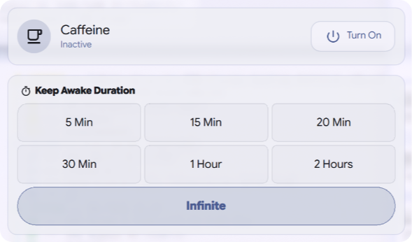
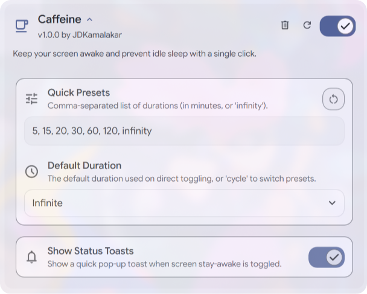

# [DMS-Caffeine](#)

### Premium Caffeine Screen & System Sleep Management

Keep your screen awake and prevent system idle sleep – easier than ever on the Dank Material Shell.

## Requirements

- **Dank Material Shell (DMS)** environment installed and active.
- Linux system supporting standard DBus idle inhibition / DPMS interfaces (`systemd-inhibit`, `xset`, or compositor inhibition).

## Download

## Features

- **Instant Toggle & Timers**: One-click screen wake lock along with customizable quick timer presets.
- **Real-time Status Monitoring**: Live indicator tracking active inhibition timers and system power state.
- **Seamless Action Header**: Sleek action controls with dynamic corner animations for Quick Toggle and Preset selection.
- **Material Aesthetics**: Smooth glassmorphic design and micro-animations styled natively for DMS.
- **Deep Customization**: Separate toggles for auto-inhibit on media playback, custom timer durations, and presentation mode.

## Interface

  
  

## Configuration

  

## Contributing

Pull requests are welcome. For major changes, please open an issue first to discuss what you would like to change.

Before reporting a new issue, take a look at the [FAQ](https://github.com/JDKamalakar/DMS-Caffeine/wiki), the [changelog](https://github.com/JDKamalakar/DMS-Caffeine/releases) and the already opened [issues](https://github.com/JDKamalakar/DMS-Caffeine/issues).

### Credits

Built with ❤️ for the [Dank Material Shell](https://github.com/DankMaterialShell) community.

### Disclaimer

This plugin is part of the Dank Material Shell suite for system sleep and idle inhibition control.

### 📜 License

Part of DankMaterialShell. Check the main repository for license information.

